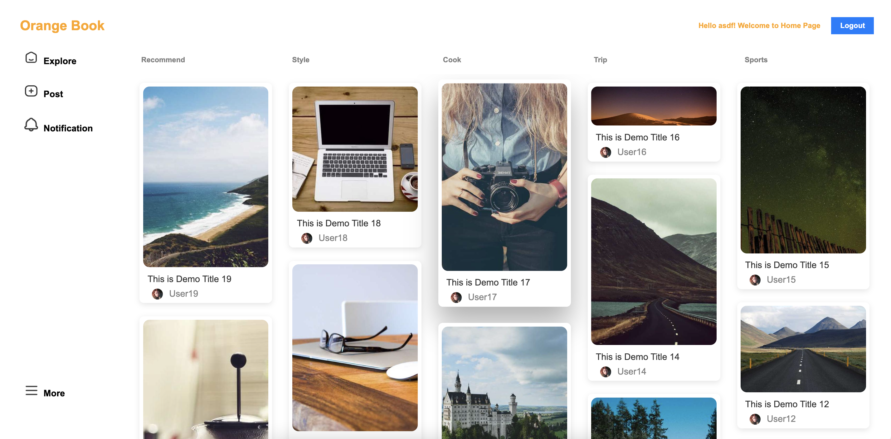
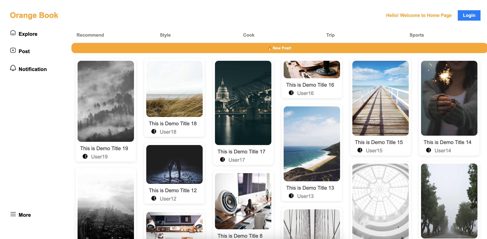
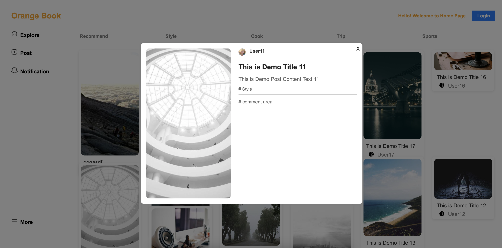
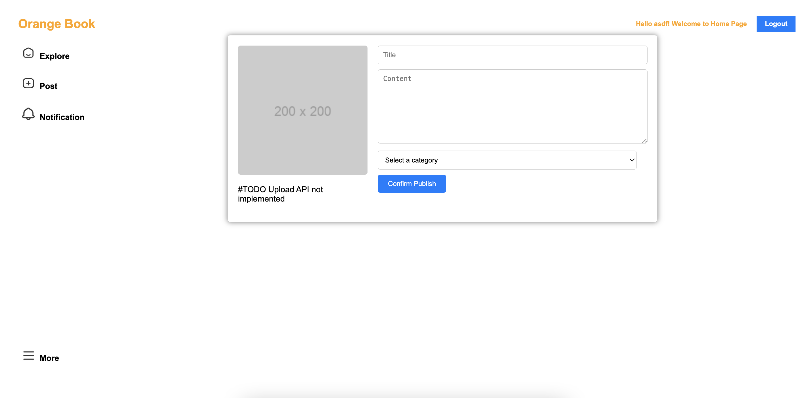
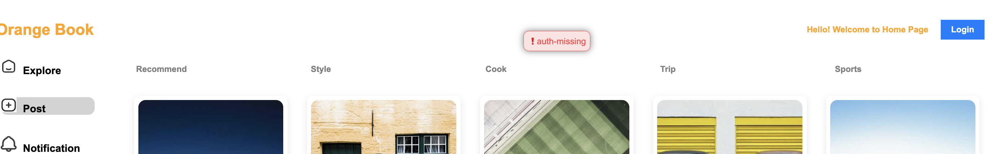
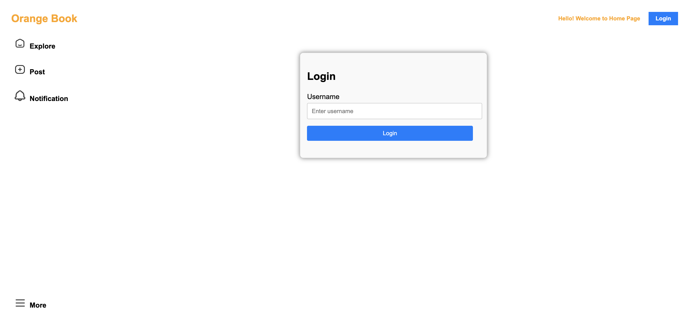

# OrangeBook - Full Stack Demo Project
---
## Functionality
### Exploring people's posts
This project provide a new solution of photos focused forum web application. Unlike traditional forum this type of posts content focus on users' photos sharing. 

In the home page, you can choose to explore different category of posts by tap on different category button above the posts(Recommend, Style, Cook, Trip and Sports).

When there are new posts availble, you can see a new post notification that is so big.

Click on a post that interests you most to see the detail!
In the pop up detail page you can see the post photo and title, content, category and comment areas. (Muiltiple photos upload and user comment functions not implemented yet)

### New post
As a user logged in, you can post anything clicking on Post button on the sidebar.

User can not post when not loggin in

### User Login

---
## Client Side
- React based
- Waterfall layout using library **waterfalljs-layout/react**
- List of React Components: Header, Login, AddPost, Category, Content, Error, Feed, Loading, App
- State management or hooks: useState, useReducer, useRef
- Involve automatic **polling** when detected new posts
- Errors handling

## Server side
- Express.js
- Async services implemented using Promise.
    - GET /api/session
    - POST /api/session
    - DELETE /api/session
    - GET /api/category/:category
    - POST /api/post
    - GET /api/post/current-user
    - GET /api/posts/:username
    - POST /api/upload